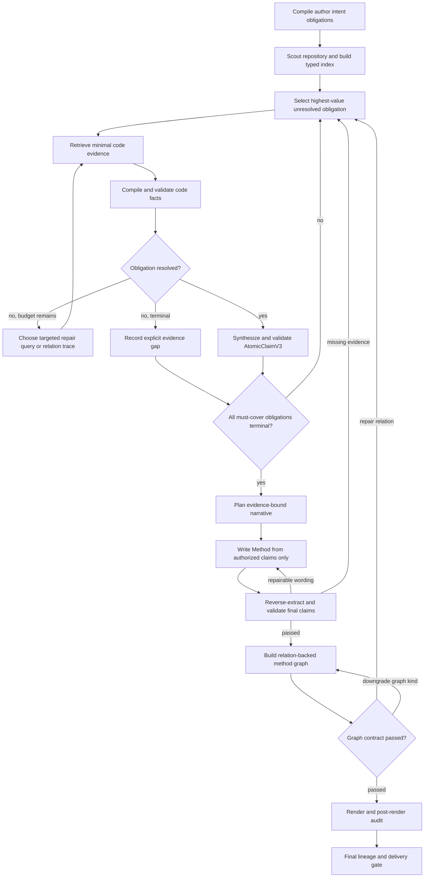

# Code2Paper 可决策研究写作 Agent V2 设计

状态：保留为 V2 设计历史；2026-07-19 起由鲁棒 Research Agent 总体设计取代  
适用分支：`codex/agentic-p4-benchmark-cutover` 及其后续分支  
取代范围：`agentic_refactor_final_design.md` 中已经完成的实现历史仍保留，但其 P2/P4 完成结论和最短实施路径不再作为当前决策依据。

> 当前规范性架构为 `docs/agentic_robust_langgraph_research_writing_design_2026-07-19.md`，规范性实施步骤为 `docs/agentic_method_quality_next_execution_plan_2026-07-19.md`。本文件中的 evidence-first 原则继续有效，但固定阶段图、项目级 compiler/profile 和粗粒度 stage tool 不再是目标形态。

## 1. 目标与边界

Code2Paper V2 的目标不是把固定流水线换成更多 LLM 节点，而是实现一个同时满足以下条件的研究写作 Agent：

1. 作者意图决定“查什么、优先解释什么、如何组织”，但不能决定“代码实现了什么”。
2. LangGraph 允许 Agent 根据未解决的意图义务、证据缺口和验证失败选择下一步。
3. LangChain 工具只执行有类型、可审计、可重复的动作，不直接签发科学结论。
4. 方法正文中的每一个事实性原子 claim 都必须回到最小、直接、快照绑定的代码证据。
5. 方法图中的每一个可见标签和每一条关系边都必须分别回到代码证据；渲染忠实不等于语义可信。
6. 代码没有提供的机制只能进入 gap report，不能靠 README、论文草稿、作者措辞或模型常识补齐。
7. “可信”与“可用”必须同时成立：不泄漏 unsupported claim 只是底线，系统还必须尽可能覆盖源码已经实现、且与作者主线相关的核心方法机制。

一句话架构是：

> 作者意图产生待证明义务；代码工具产生候选证据；确定性 validator 签发可写 claim；LangGraph 决定继续取证、降级表达、重写、制图或安全阻断。

## 2. 当前真实产物给出的结论

本设计基于 2026-07-18 保留在 `/tmp` 的五个真实项目产物，而不是只依据单元测试或阶段文档。

| 项目 | 作者 story 阶段 | 投影 claim / 去重后 | 最终事实 claim | 最终正文词数 | 每个投影 claim 平均直接证据数 | 图节点 / 图边 |
|---|---:|---:|---:|---:|---:|---:|
| EBCAR | 5 | 10 / 5 | 8 | 169 | 14.3 | 5 / 0 |
| DyG-Mamba | 4 | 6 / 4 | 5 | 129 | 20.3 | 3 / 0 |
| RAP | 4 | 2 / 1 | 1 | 28 | 20.0 | 4 / 0 |
| LinearRAG | 5 | 7 / 3 | 3 | 116 | 9.1 | 4 / 0 |
| Lookahead | 4 | 2 / 1 | 1 | 32 | 20.0 | 1 / 0 |

这些数字说明：

- `final unsupported rate = 0` 证明了泄漏控制，不能证明方法覆盖充分。
- EBCAR 的“Motivation”标题下实际写的是点积排序，说明 story stage 与 claim 的绑定不是语义闭环。
- RAP 源码已经包含 `PrunePredictor`、特征计算、权重加载、前向打分和基于排序掩码的 pruning；当前系统却只交付了特征描述。问题不是“代码完全没有方法”，而是无法把宽泛作者 claim 安全拆成较窄的代码事实。
- RAP 的训练程序和三项损失确实不在可交付源码中；它们必须继续被排除。这与保留源码中已有的 MLP 推理和 pruning 机制并不冲突。
- 五张真实方法图总计 17 个节点、0 条边。当前 P2 只能证明“已画出的边有证据”，无法证明产物构成有用的方法流程图。
- 图节点标签来自 author-facing stage name，而节点 claim/evidence 来自另一个机制。EBCAR 的 Motivation 节点绑定 inference claim，RAP 的“three loss terms”节点绑定通用 score mapping 证据；当前图标签没有经过与最终正文同等级的语义验证。

因此当前状态应解释为：

- 正文泄漏防线：已建立，但 recall 和结构正确性不足。
- 图渲染/漂移防线：已建立，但图标签语义和拓扑完整性不足。
- LangGraph/工具/checkpoint 基础设施：可复用。
- P4 cutover：不能继续沿用现有 gold 和 observation 信任模型授权默认切换。

## 3. 结果不好的机制性原因

### 3.1 作者意图被扁平化成检索字符串

当前 retrieval plan 把 module role、pipeline step、priority file、design intent 等大量文本展开成几十个 target。宽泛 target 可以因为两个通用 token 或某个路径命中而显示 `covered`，但这不代表核心机制已经被取证。

后果是：

- target coverage 看起来为 0.64--0.90，最终却只能写 1--8 个事实 claim；
- narrative 文件仍会参与 retrieval coverage，导致“coverage 高、hard evidence 低”的错觉；
- rescan 已覆盖计划项，不等于解决了作者的高优先级机制义务。

### 3.2 claim 先继承作者措辞，再寻找大证据并集

当前 claim 多来自作者 mechanism、claim contract 和 stage scaffold。验证器随后把大量候选 EvidenceSpan 合并后做词法/概念相关性判断。单个投影 claim 最多携带 22 个直接证据，扩大了偶然词法命中的机会，也让错误证据难以定位。

正确顺序应该相反：先从一到三个最小代码 span 编译一个精确代码事实，再判断它能覆盖作者义务的哪一部分。

### 3.3 不支持整个句子时，没有可靠地产生“支持的子句”

例如 RAP 的作者意图把“trained MLP、任意 3DGS、forward、threshold pruning、without rendering/retraining”写在一个句子里。当前机制会整体拒绝它；但代码实际上可支持其中较窄的事实：

- 构造并加载 `PrunePredictor`；
- 计算 per-primitive feature；
- 前向产生 score；
- 根据 score 排序构造 mask 并删除 primitive。

V2 需要 obligation decomposition 和 evidence-first claim synthesis，而不是在“整句照写”和“整句删除”之间二选一。

### 3.4 stage、claim、evidence 和 heading 是四套弱连接对象

当前 authoring projection 可以把一个已支持 claim 填进语义不匹配的 story stage；deterministic writer 再忠实复用 stage name，于是得到“标题讲动机、正文讲排序”的结果。

阶段标题本身也是论文事实边界的一部分，必须绑定到该阶段的已授权 claim，而不能只被视作无风险结构文本。

### 3.5 图只验证存在的边，未验证应有的图

`hard_gate_passed = bool(nodes) and all(...)` 允许任意多个无边节点通过。Post-render audit 又只验证 SVG 是否忠实复制 scene，因此“17 个孤立节点”可以被报告为可信方法图。

V2 必须区分：

- `method_flow`：要求代码关系支撑的连通有向图；
- `component_map`：允许无流程边，但不能伪装成流程；
- `evidence_atlas`：只展示孤立的已支持事实卡片，并明确不是方法流程图。

### 3.6 writer 只能重排已有 claim，不能恢复被上游丢掉的代码事实

当前 projection writer 的安全边界是正确的：它只能消费授权 claim。但这也意味着一旦 analysis/evidence 阶段没有生成 `PrunePredictor`、权重加载、score 和 mask/prune 等较窄 claim，writer 无论多强都只能写出 RAP 的单一 feature 句子。

因此正文质量优化不能以“换更强写作 prompt”为主。优先级必须是：

1. 把作者主线拆成待解决义务；
2. 针对每个义务取得最小代码事实；
3. 从代码事实编译窄 claim；
4. 最后才让模型决定叙事顺序和篇幅。

### 3.7 现有 LangGraph 释放了流程分支，没有释放研究写作决策

当前 graph 已能 checkpoint、resume，并在 retrieval/evidence/text failure 之间循环；但循环的决策单位仍是旧 stage、coverage score 或宽 claim。它不知道“RAP 的 score-to-mask pruning 义务尚未解决”，因此容易全量重跑或把缺口安全删除。

V2 的核心状态必须从 `current_stage` 升级为 `active_obligation`，repair 路由必须携带具体问题、候选 symbol、失败类型和本轮预期增加的正文信息。

## 4. 不可妥协的不变量

### T1. 意图只产生义务，不产生事实

作者 YAML、README、Markdown、TeX、PDF 和论文草稿只能创建 `IntentObligation` 或检索 hint，不能创建 `SupportedClaim`、FigureNode 或 FigureEdge。

### T2. 最小直接证据

每个可写 claim 必须绑定最小充分证据集，默认上限为 3 个 span。超过上限必须给出 composition rationale，并逐个说明 span 的角色。

### T3. claim 是从证据编译的

可写 claim 的 canonical wording 必须由 Evidence Compiler 生成。作者原句只能用于判断 coverage，不能直接成为 canonical wording。

### T4. 部分支持必须结构化分解

一个 obligation 可以产生多个 supported subclaim、多个 unresolved sub-obligation 和一个 coverage verdict。禁止只用字符串截断或模糊 caveat 表示 partial。

### T5. 标题也是受控文本

section heading、figure label、annotation 和 edge label 与正文句子采用相同的 claim/evidence validator。

### T6. 图节点和图边分别取证，图类型由拓扑决定

无 relation evidence 时不得画箭头。多节点无边时不得命名为 pipeline/flow/framework overview；只能降级为 component map 或 evidence atlas。

### T7. validator 重算，不相信上游 verdict

validator 从 source snapshot、exact excerpt、claim contract 和 final artifact 重算结果。上游模型或 JSON 中的 `supported=true` 只是 proposal。

### T8. 源码支持的核心义务不得静默丢失

每个 `must_cover` 义务必须终结为 supported、partial、contradicted、not implemented 或 budget-exhausted gap。禁止因为 projection 中没有 claim 就让作者主线无记录地消失。

### T9. 标题和组织不得扩大 claim

section heading、过渡句和段落组织只能概括本节已授权 claim。作者提供的 motivation、novelty、benefit 或 deployment 标签不能因为“只是标题”绕过证据边界。

## 5. 核心数据模型

### 5.1 IntentObligationGraphV1

作者意图先被编译成义务图，而不是直接进入 writer：

```json
{
  "obligation_id": "O-RAP-DEPLOY-1",
  "kind": "mechanism",
  "priority": "must_cover",
  "author_wording": "feedforward inference and threshold pruning without rendering",
  "questions": [
    "which function computes the score",
    "which function applies the pruning mask",
    "does the scoped inference path invoke a renderer"
  ],
  "candidate_paths": ["prune_percent.py", "utils/net_utils.py"],
  "status": "unresolved"
}
```

义务类型至少包括：`stage`、`component`、`transformation`、`objective`、`relation`、`condition`、`negative_scope` 和 `organization`。

`must_cover` 义务必须得到 `supported`、`partially_supported`、`contradicted` 或 `not_implemented_in_repo` 的明确终态，不能静默丢失。

### 5.2 EvidencePacketV3

每个义务独立拥有 evidence packet：

- 1--3 个最小 source/config/script/build span；
- AST symbol identity 和 exact line/excerpt digest；
- 可选 call/data/control-flow relation；
- 条件与作用域；
- 被排除的相似候选及原因；
- 对负面 claim，只允许 function/module scoped absence certificate，禁止把全仓库“没搜到”写成系统级不存在。

### 5.3 CodeFactV1

Evidence Compiler 把代码 span 编译为类型化事实：

```json
{
  "fact_id": "F-RAP-PRUNE-1",
  "subject": "prune_pure_feature",
  "predicate": "calls_in_order",
  "object": ["get_prune_input_f15", "PrunePredictor.forward", "prune_points"],
  "conditions": ["checkpoint weights are loaded"],
  "scope": "prune_percent.py:prune_pure_feature",
  "direct_evidence_ids": ["E1"],
  "relation_evidence_ids": ["R1", "R2"],
  "strength": "direct"
}
```

#### RAP reference compilation contract

2026-07-19 的完整 Gemma 盲跑证明，V3 不能只换 schema 名称；它必须改变“检索后如何形成事实”的执行语义。该 run 已检索到 77 个 spans，并包含所有关键 symbol，却仍将完整 feature claim 错绑到两个 anisotropy helper，最终只生成 48 词候选正文并被逐句 gate 阻断。机器证据见 `docs/agentic_rap_gemma_quality_eval_2026-07-19.json`。

RAP 是 Evidence Compiler 的首个 reference contract。编译器必须从三个文件恢复下列有向事实链，而不是从作者 stage 文本生成宽 claim：

```text
utils/gaussian_model.py:get_prune_input_f15
  --constructs--> per-primitive normalized feature tensor
  --consumed_by--> utils/net_utils.py:PrunePredictor.forward
  --produces--> two-class Softmax output
  --selected_by--> prune_percent.py:scores = predictor(... )[:, 0]
  --ranked_by--> argsort(descending=True)
  --selects--> top int(N * keep_percent)
  --constructs--> boolean valid_mask
  --filters_by--> utils/gaussian_model.py:prune_points
  --writes--> pruned PLY and score NPY
```

最小 packet 不是“某个 stage 的全部相关证据并集”，而是三个具有单一职责的组合：

- `EP-RAP-FEATURE`：`get_prune_input_f15` 为 anchor，local/global z-score 与 percentile normalization 为 relation/semantic spans；
- `EP-RAP-PREDICTOR`：`PrunePredictor.__init__`、`load_model`、`forward`；
- `EP-RAP-PRUNE`：`prune_pure_feature`、`prune_points` 和 output write。

packet validator 必须检查 predicate compatibility。比如 `compute_sh_anisotropy_loop_std` 可支撑“计算 SH color anisotropy 子特征”，但不能支撑“读取 scale/opacity/DC color、计算 KNN z-score 并构造完整 feature tensor”。即使 lexical/embedding 相似度很高，这种绑定也必须被拒绝，并返回 `wrong_span_role`，而不是继续标记 supported。

`CodeFactV1` 的 canonical identity 至少由 `(snapshot, scope, subject, predicate, normalized object, condition)` 决定。多个作者入口或旧 claim 映射到同一个 identity 时只能产生一个事实；claim compiler 再依据 obligation coverage 复用该 fact，不能制造 `C2/C9` 这种同文、同 evidence 的重复 claim。

首批 predicate 还需补充 `selects_column`、`sorts_by`、`selects_top_k`、`constructs_mask` 和 `writes_artifact`。这些不是为了 RAP 特判，而是把常见科研代码中的“模型输出如何变成最终决策”表示为 writer 可消费、validator 可重算的事实。

final text validator 的 repair route 也必须类型化：

| validator failure | 返回节点 | 禁止动作 |
|---|---|---|
| `wrong_span_role` / `direct_evidence_semantically_unrelated` | packet binding repair | 泛化 rescan、writer retry |
| relation missing | `trace_call_flow` / `trace_data_flow` | 用大 span 猜测顺序 |
| duplicate canonical behavior | fact/claim dedup | 把重复 claim 分成多个小节 |
| author fragment has semantic hint only | explicit code gap | 反复搜索同一源码关键词 |
| wording exceeds validated fact | constrained rewrite | 放宽 evidence gate |

因此 LangGraph 中“模型认为 coverage 足够”不再直接等价于 obligation covered。coverage critic 只能提出下一动作；只有 `validate_code_fact` 或 explicit gap artifact 能把义务推进到 terminal 状态。

### 5.4 AtomicClaimV3

```json
{
  "claim_id": "C-RAP-PRUNE-1",
  "canonical_text": "The inference entrypoint computes per-primitive features, applies the loaded predictor to obtain scores, and removes the lowest-ranked primitives through a boolean mask.",
  "fact_ids": ["F-RAP-PRUNE-1"],
  "covers_obligation_ids": ["O-RAP-DEPLOY-1"],
  "direct_evidence_ids": ["E1"],
  "required_qualifiers": ["in the provided inference entrypoint"],
  "unsupported_author_fragments": ["no retraining is required for every scene"],
  "status": "supported"
}
```

AtomicClaimV3 必须显式区分：

- `implementation_behavior`：可进入 Method；
- `configuration_fact`：可在必要时进入实现细节；
- `design_rationale`：只有代码中存在直接约束时才可作为事实，否则只影响组织，不写入 Method；
- `performance_or_novelty`：默认禁止，仅代码不能支持论文效果与新颖性。

### 5.5 MethodGraphContractV3

图节点直接引用 `AtomicClaimV3`，标签只能从 canonical claim wording 的受控短写生成。图边直接引用 `RelationEvidenceV3`。Contract 还必须包含：

- `graph_kind`；
- must-cover obligation coverage；
- connected components；
- relation coverage；
- label validation verdict；
- topology downgrade reason。

## 6. LangChain 工具边界

工具按证据动作拆分，不按旧 pipeline stage 打包：

| 工具 | 输入 | 输出 | 可签发 trust verdict |
|---|---|---|---|
| `scan_repo_manifest` | snapshot + ignore policy | typed file/symbol index | 否 |
| `search_code_candidates` | obligation + queries | ranked code candidates | 否 |
| `read_exact_span` | path + symbol/lines | EvidenceSpanV3 | 否 |
| `trace_call_flow` | source/target symbols | RelationEvidence proposal | 否 |
| `trace_data_flow` | producer/consumer | RelationEvidence proposal | 否 |
| `read_config_binding` | config key + consumer | config/source pair | 否 |
| `build_scoped_absence_certificate` | function/module scope + forbidden call class | scoped negative evidence | 否 |
| `compile_code_fact` | minimal spans + relation | CodeFact proposal | 否 |
| `validate_code_fact` | snapshot + proposal | deterministic verdict | 是 |
| `compile_atomic_claim` | validated facts + obligation | AtomicClaim proposal | 否 |
| `validate_atomic_claim` | claim + facts + qualifiers | deterministic verdict | 是 |
| `validate_final_text` | final text + claims | reverse trace verdict | 是 |
| `validate_method_graph` | scene + claims + relations | semantic/topology verdict | 是 |

所有工具必须声明 `input_schema`、`output_schema`、`side_effects`、`idempotency_key`、`snapshot_binding` 和 `evidence_policy`。检索/编译工具不能把自己的 proposal 标记成最终 supported。

## 7. LangGraph 决策图



模型可以决定：

- 下一个义务；
- 查询、symbol、path 或 relation 工具；
- 在预算内继续取证还是把义务终结为 gap；
- 已授权 claim 的章节顺序与篇幅；
- 选择 method flow、component map 或 evidence atlas 的候选布局。

模型不能决定：

- source 是否属于 hard evidence；
- excerpt 是否与 snapshot 一致；
- claim 是否 supported；
- figure label/edge 是否可信；
- final invariant 是否通过；
- 源码已经实现但被上游遗漏的义务是否可以不记录。

## 8. 质量与可信度双平面

V2 不再用一个 `hard_gate_passed` 混合所有目标。

### Trust plane

- unsupported leakage = 0；
- high-risk false support = 0；
- 每个最终 claim 的最小证据和 qualifier 完整；
- 每个图标签和边的语义精度 = 1；
- freshness、trace exactness、render drift、package lineage 全通过。

Trust plane 失败必须 block。

### Coverage plane

- must-cover obligation terminal coverage；
- code-supported obligation recall；
- section-stage semantic alignment；
- claim duplication rate；
- evidence fan-in/minimality；
- figure node/edge obligation coverage；
- normal-project usable completion 和源码支持义务 recall。

Coverage 不足时优先回到取证；预算耗尽后可以交付“可信但明确不完整”的方法和 gap report，是否允许交付由产品策略决定，但不能把它计为 default-ready usable completion。

## 9. 正文生成的决策闭环

正文主循环以义务为单位，而不是以旧 pipeline stage 为单位：

1. 选择最高价值的 unresolved obligation；
2. 搜索候选 path/symbol；
3. 读取最小 span，并在必要时追踪 call/data/config relation；
4. 编译并验证 CodeFact；
5. 若事实不足，按失败类型定向 repair；
6. 若事实成立，生成窄 AtomicClaim；
7. 更新 obligation coverage；
8. 所有 must-cover 义务达到终态后，规划 Method；
9. 最终正文反向验证失败时，区分 wording repair 与 missing-evidence repair。

每次循环必须回答三个问题：当前解决哪个论文方法问题、调用哪个代码工具、成功后正文会增加哪条信息。无法回答时不得做全量重跑。

## 10. Benchmark 与 rollout 的位置

Benchmark 仍有价值，但它只在真实正文架构稳定后承担发布回归职责，不是当前优化目标，也不应决定数据模型。

未来发布前需要补齐的事项保留为 deferred work：可判别的正常/故障 gold、从原始 artifact 重算的 observation extractor、正确的 false-block、shadow/opt-in/canary 和可重放 default authorization。当前 25-run 矩阵只作为历史安全性证据，不能替代 RAP/EBCAR/DyG-Mamba 的正文可用性改进。

## 11. Definition of Done

V2 完成不以文件数量、节点数量或测试数量定义，而以以下外部行为定义：

1. 对 RAP，系统保留源码支持的 feature、MLP architecture、score inference 和 pruning path，同时继续拒绝仓库中缺失的训练/三项损失细节。
2. 对 EBCAR，section heading 与其正文 claim 语义一致，不再把 inference claim 放到 Motivation 下。
3. 对 DyG-Mamba，每个交付的 SSM 参数机制分别拥有最小证据；未证实的 spectral/co-occurrence/source-destination 内容有明确 gap。
4. 对五个真实项目，最终正文 unsupported leakage 仍为 0，同时 must-cover code-supported obligation recall 显著高于当前基线。
5. 方法图不存在 author-only 标签；有箭头时每条边有 direct relation evidence；没有关系证据时产物正确降级而不是伪装成 flow。
6. 对每个真实项目，系统同时交付 obligation coverage 和 gap report；源码支持的核心机制不能因宽作者句被整体拒绝而静默消失。
7. LangGraph 的 repair 记录能指出具体义务、失败类型、候选代码位置和预算，而不是只记录“回到 analysis”。
8. writer 接收的是 evidence-first canonical claims；更换 deterministic/Gemma writer 不改变允许写入的事实集合。
