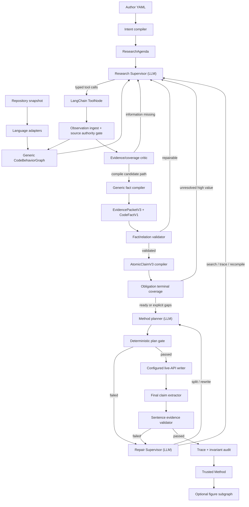

# Code2Paper 鲁棒 LangGraph 研究写作 Agent 总体设计

> **Agent 自主修复原则（规范性）：**规则层发现格式、schema、证据或内容错误后，
> 必须形成 typed repair issue 并返回 owning Agent 做有界重试；禁止用静默过滤、
> deterministic fallback 冒充成功、放宽硬门或降低义务覆盖来换取通过。详见
> `docs/agentic_error_feedback_and_self_repair_principle.md`。

状态：后续架构改造的规范性设计  
日期：2026-07-19  
最后更新：2026-07-28（正式 live API 与有界思考协议）
首要交付：根据作者意图与代码信息，生成信息完整、组织合理、逐句可回溯到代码证据、可继续编辑成论文的 Method 正文。  
次要交付：只从已授权 Method claim 投影方法图。  
延后事项：benchmark、cutover 和默认切换只用于发布验证，不驱动近期架构。

> **2026-07-28 规范更新：**正式验收不再绑定 Gemma-4、TP=2、GPU=2
> 或固定采样/输出预算。任一可追踪的正式 API 均可用于 R8，但必须关闭
> response cache，并在 summary 与逐调用 trace 中保存 provider、model、脱敏
> endpoint、capability profile digest、role、非空响应和 finish reason。并行拓扑、
> GPU 数、采样参数、输出预算和思考预算仅作为执行元数据，不再构成硬门。
> Qwen3.6 可开启有界思考：达到 `thinking_token_budget` 后由服务端结束思考并继续
> 生成正文；正文输出预算与思考预算彼此独立。证据授权、holdout 和 fail-closed
> 约束不因模型或部署变化而放宽。

## 1. 设计结论

Code2Paper 不应继续演化为“固定 Python 流水线 + 若干具名项目 compiler”。目标架构是一个受证据硬门约束的研究 Agent：

- LangGraph 保存研究状态、决策历史、checkpoint 和可恢复分支；
- LangChain StructuredTool 暴露细粒度、只读或受控写入的代码检索与证据编译能力；
- LLM 负责理解作者意图、制定研究计划、选择工具、判断下一步搜索方向、拆分写作义务、规划正文和局部修复；
- 通用 `CodeBehaviorGraph` 从 AST、调用、数据、控制和配置关系中编译代码行为；
- `EvidencePacketV3 -> CodeFactV1 -> AtomicClaimV3` 决定什么事实可以进入正文；
- deterministic validator、freshness、snapshot 和 invariant audit 决定是否可信完成；
- behavior template/profile 只增强路径发现和术语映射，不能拥有项目事实或绕过通用 compiler。

核心原则是：

> LLM 决定研究行为，代码证据决定科研陈述。

## 2. 当前实现与目标的差距

当前 LangGraph 已经具备 checkpoint、固定决策节点、LLM proposal、安全 merge、正文反向验证和 invariant gate，但仍是“固定阶段流水线的 graph shell”：

1. 图节点主要沿 `input -> intake -> analysis -> evidence -> grounding -> authoring -> validation` 前进；
2. LLM 只能在 coverage、evidence sufficiency、authoring、revision 等固定节点提出有限路由；
3. LangChain 工具主要把整个 stage 包装成 `StructuredTool(state)`，Agent 不能自主组合代码搜索动作；
4. Evidence Compiler V3 依赖 RAP 固定路径、符号、正则和 claim 文本；
5. obligation coverage 仍混有英文 lexical overlap 和 RAP-specific claim 分组；
6. EBCAR、DyG-Mamba、LinearRAG 已证明：源码已经被检索到，并不等于 writer 获得了最小、可写、可验证的事实；
7. 全局 retry 会重建无关 artifact，且中间质量可能回退；
8. run-level semantic-verifier budget 会让普通事实句竞争同一个验证额度。

因此，下一阶段不是给当前流水线增加更多 loop，也不是继续复制项目 profile，而是增加一个真正的 Agent research loop 和通用行为编译层。

## 3. 不可妥协的约束

### 3.1 源权威等级

| 等级 | 内容 | 允许用途 |
|---|---|---|
| `executable_hard` | 源码、运行脚本、构建文件、配置 | 支持实现行为、配置、调用和输出 claim |
| `test_scoped` | 测试源码、fixture | 支持测试范围内的预期和边界；不能单独证明生产主线 |
| `semantic_hint` | README、Markdown、论文草稿、TeX、PDF、纯文本 | 生成搜索查询、术语别名和 mismatch check；禁止直接支持正向实现 claim |
| `author_intent` | 作者 YAML | 决定研究优先级、组织偏好和待验证义务；禁止替代代码证据 |
| `author_attested` | 作者对精确 review item 的明确确认 | 支持设计动机、术语和仓库外方法事实；禁止支持未确认实现或实验效果 |
| `formal_derivation` | 带前提、定义和推导 trace 的形式化 artifact | 支持公式、等价算法表达和限定结论；禁止无前提理论保证 |
| `empirical_artifact` | 冻结日志、表格和实验结果 | 支持其范围内的经验 claim；禁止外推 |
| `external_literature` | 已验证的论文和一手资料 | 支持背景、已有理论和引用对比；禁止证明本仓库已实现 |

任何最终**实现句**必须绑定 `executable_hard` span，必要时再绑定
call/data/control/config relation；任何其他 factual span 必须绑定与其 claim class
匹配的 authority。`semantic_hint` 即使与原论文完全一致，也不能静默升级为正向
证据。代码中没有找到，只能说明 `unverified_by_repository` 或某个实现义务存在
`explicit_code_gap`，不能据此断言作者叙事为假。多权威写作和作者确认的完整合同见
[可投稿 Method Writer Agent 设计](publication_ready_method_writer_design_2026-07-31.md)。

### 3.2 LLM 权限边界

LLM 可以：

- 把作者意图编译为候选 obligation；
- 判断哪个 obligation 信息价值最高；
- 选择下一工具和检索范围；
- 提议符号、别名、候选路径和分支；
- 提议 packet composition、fact predicate、claim decomposition；
- 规划 Method 的语义段落与顺序；
- 根据 validator issue 选择补证、拆 claim、降级、gap 或局部改写。

LLM 不可以：

- 把自己的解释标为 supported；
- 伪造文件、行号、符号、调用或数据关系；
- 将 hint、作者 YAML 或论文文本绑定为实现硬证据；
- 绕过 snapshot、freshness、fact validation、claim authorization 或 final reverse validation；
- 在证据不足时通过增加修辞、方程或 qualifier 扩张事实边界；
- 直接执行 shell、任意文件写入或 snapshot 范围外访问。

所有 LLM 输出都是 proposal，只有 deterministic policy merge 和 validator 可以改变可信状态。

### 3.3 规范运行环境

Code2Paper 编排、LangChain/LangGraph 工具、测试和 Agent 客户端统一运行在：

```text
/home/cuihengjia/miniconda3/envs/code2paper
Python 3.11.15
```

当前工作区以 editable 方式安装到该环境，核心版本固定为 `langchain-core==1.4.9`、`langgraph==1.2.8`、`langgraph-checkpoint-sqlite==3.1.0`。所有自动化验证必须显式使用 `conda run -n code2paper`，不能依赖默认 `base` 环境。

模型服务属于独立部署环境。研究 Agent 只通过所配置的正式 API 调用它；编排环境与模型服务环境不合并，以避免 CUDA/vLLM 依赖污染通用 Agent 工具和测试环境。当前 Qwen3.6/vLLM 配置只是一个可复现实例，不是规范性模型或硬件要求。

## 4. 总体架构



与当前架构相比，关键变化有三个：

1. 先建立通用 `CodeBehaviorGraph`，profile 不再是事实编译前置条件；
2. 引入 `Research Supervisor -> ToolNode -> Observation ingest -> Critic` 的可循环研究子图；
3. 全局 stage retry 改为 issue-scoped repair，正文失败能精确回到搜索、relation、fact、claim 或 writer 层。

## 5. AgentStateV3

新增状态模型，避免把完整 artifact 内容反复塞进 LLM prompt：

```text
AgentStateV3
  run_id
  repo_snapshot_id
  project_tree_hash
  source_authority_policy

  intent_graph_ref
  behavior_graph_ref
  symbol_index_ref
  research_agenda_ref

  evidence_packet_set_ref
  code_fact_set_ref
  atomic_claim_set_ref
  explicit_gap_set_ref
  obligation_coverage_ref

  current_quality_state_ref
  best_quality_state_ref

  active_obligation_id
  active_issue_id
  pending_tool_calls
  recent_observation_refs
  decision_trace_refs
  tool_call_trace_refs

  per_obligation_budgets
  global_safety_budget
  no_progress_counters

  authoring_plan_ref
  method_draft_ref
  final_validation_ref
  status
  blocked_reason
```

状态只保存 artifact reference、digest 和紧凑决策上下文。源码片段、行为图和 packet 由工具按需读取，避免长 prompt 导致模型注意力稀释。

## 6. 通用 CodeBehaviorGraph

### 6.1 目标

`CodeBehaviorGraphV1` 是跨项目鲁棒性的核心。它描述“代码做了什么”，而不是“项目叫什么”。Python 首先使用标准 AST；后续语言通过 adapter 扩展。不得使用项目名或论文标题生成行为事实。

### 6.2 图节点

```text
BehaviorNodeV1
  node_id
  symbol_id
  operation_id
  predicate
  operands
  result
  guard
  iteration_context
  shape_or_type_hints
  source_span_id
  source_authority
  confidence
```

首批通用 predicate：

```text
READ           WRITE          CALL
CONSTRUCT      LOAD           RETURN
TRANSFORM      CONCAT         STACK
NORMALIZE      REDUCE         AGGREGATE
COMPUTE        COMPARE        BRANCH
LOOP           SELECT         TOPK
SORT           MASK           FILTER
RESHAPE        PROJECT        ATTEND
SAMPLE         PROPAGATE      SERIALIZE
```

predicate 是静态行为类别，不直接包含论文术语。`ATTEND`、`PROPAGATE` 等高层 predicate 必须由较低层操作组合规则推导，并保留组成节点。

### 6.3 图关系

```text
CONTAINS
NEXT_CONTROL
TRUE_BRANCH / FALSE_BRANCH
CALLS
RETURNS_TO
DATA_DEPENDS_ON
CONTROL_DEPENDS_ON
CONFIGURED_BY
READS_FROM
WRITES_TO
ALIAS_OF
OVERRIDES
IMPLEMENTS
```

所有 relation 都必须落到至少一个 exact source span；跨函数关系同时记录 source/target symbol 和调用位置。

### 6.4 语言 adapter

统一接口：

```python
class LanguageBehaviorAdapter(Protocol):
    language: str
    def index_symbols(snapshot: RepoSnapshot) -> SymbolIndexV2: ...
    def extract_operations(symbol: SymbolRef) -> list[BehaviorNodeV1]: ...
    def extract_relations(symbol: SymbolRef) -> list[BehaviorRelationV1]: ...
    def resolve_references(symbol: SymbolRef) -> ReferenceSetV1: ...
```

首批只实现 Python，但 contracts 不得写死 Python AST 类型。无法精确解析的动态调用标为 `unresolved_dynamic_relation`，交给 Agent 搜索或终结为 gap，不能猜测。

### 6.5 行为模板而非项目 profile

模板只包含声明式 graph query：

```text
BehaviorTemplateV1
  template_id
  required_predicates
  required_relations
  optional_predicates
  role_aliases
  stage_hint
  match_confidence
```

示例模板：

- `feature_predict_score_rank_filter`
- `embedding_augment_dual_attention_rerank`
- `temporal_multichannel_sequence_readout`
- `sparse_bipartite_propagation_ppr`

模板不能生成硬编码 claim 文本。它只能帮助 Agent 定位候选子图、映射领域角色和建议 stage grouping。最终 facts/claims 必须由通用 compiler 从实际匹配子图生成。

## 7. 暴露给 Agent 的 LangChain 工具

当前“整阶段工具”继续保留给兼容层，但 Research Agent 使用下列细粒度 StructuredTools。所有工具有 Pydantic input/output schema、snapshot scope、调用 digest、上限和 source authority metadata。

### 7.1 仓库与符号检索

| 工具 | 输入重点 | 输出 | 用途 |
|---|---|---|---|
| `list_repository_tree` | path、depth、file kinds | snapshot-scoped entries | 了解项目布局 |
| `find_entrypoints` | language、path scope | scripts/main/functions/config bindings | 找运行主线 |
| `search_code` | obligation、query、kind、scope、top_k | ranked hard-source candidates | 文本/结构联合检索 |
| `search_symbols` | role/query/signature hints | symbol refs | 找类、函数、方法 |
| `read_symbol` | symbol ref、context mode | exact span + digest | 阅读完整定义 |
| `read_code_span` | path、line range | exact span + digest | 补局部上下文 |
| `find_references` | symbol ref、direction | callers/callees/usages | 追调用和消费方 |
| `inspect_configuration` | symbol/config key | defaults、branches、bindings | 判断实际条件 |

`search_code` 的 query 可以由 LLM 生成，但返回候选必须来自 snapshot index，不能返回模型编造的路径。

### 7.2 行为图查询

| 工具 | 作用 |
|---|---|
| `build_behavior_subgraph` | 对选定 symbol/path 增量解析 AST/调用/控制/数据关系 |
| `query_behavior_graph` | 按 predicate、operand、relation、guard 搜索行为 |
| `trace_call_path` | 查 entrypoint 到目标 symbol 的最短或候选调用路径 |
| `trace_data_flow` | 查输入、临时结果、score、mask、输出之间的数据依赖 |
| `inspect_control_flow` | 查 branch、loop、early return、fallback 和条件 |
| `compare_implementation_branches` | 对多个候选分支比较 reachability、配置条件和输出 |
| `find_output_side_effects` | 查写文件、保存 checkpoint、返回值和外部调用 |

这些工具默认增量工作。Agent 可以先搜索，再只为高价值候选构建子图，避免全仓昂贵分析。

### 7.3 hint 检索

| 工具 | 作用 | 硬限制 |
|---|---|---|
| `search_semantic_hints` | 从 README、草稿、TeX 等获取术语和潜在机制 | 输出永远标记 `semantic_hint` |
| `derive_code_queries_from_hint` | 把 hint 转成 symbol/operation/config 搜索查询 | 不产生 evidence id |
| `compare_hint_to_code` | 形成 match/mismatch candidate | 只有 code side 可支持正向 claim |

hint 工具用于提高 LLM 搜索能力，而不是降低证据门槛。

### 7.4 证据与事实工具

| 工具 | 作用 |
|---|---|
| `propose_evidence_packet` | LLM 提交 obligation、anchor、relation 和候选 spans |
| `validate_evidence_packet` | 确定性检查 snapshot、span role、minimality、relation、authority |
| `compile_code_facts` | 从 validated packet + behavior subgraph 编译 typed facts |
| `validate_code_facts` | 重放 predicate、guard 和 relation checks |
| `decompose_atomic_claims` | 把 facts 组合为最小可写 claim candidates |
| `authorize_atomic_claims` | 确定性检查 claim 不超出 fact boundary |
| `record_explicit_code_gap` | 记录搜索范围、尝试、缺失关系和终止理由 |
| `check_obligation_coverage` | 重新计算 supported/partial/gap/unresolved |

`propose_*` 可以由 LLM 调用；`validate_*` 和 `authorize_*` 不能由 LLM 绕过。

### 7.5 写作与修复工具

| 工具 | 作用 |
|---|---|
| `build_authoring_projection` | 只投影 authorized claims、gaps 和 stage hints |
| `validate_authoring_plan` | 检查顺序、去重、fan-in、equation、must-cover |
| `draft_method_text` | 调用已配置的正式 API writer |
| `extract_final_atomic_claims` | 从确切草稿拆句和事实 |
| `validate_final_text_evidence` | 逐句反向验证 |
| `rewrite_failed_sentences` | 只重写指定 sentence/claim，不重写整篇 |
| `split_or_merge_claim_sentence` | 修复 sentence/claim atomicity mismatch |

### 7.6 工具执行安全

- LLM 不获得 shell 工具；
- 所有 path 必须解析到 repo snapshot 或已登记 artifact root；
- 检索工具只读；
- artifact 写工具使用原子写入和 schema validation；
- 每个 tool result 记录 input digest、output digest、耗时、候选数量和截断信息；
- 工具失败返回 typed error，不能以空结果冒充“代码不存在”；
- CPU 检索工具可以并发；模型调用按当前服务容量调度，拓扑与串并行策略写入 execution metadata。

## 8. LangGraph 节点与自主决策循环

### 8.1 新增节点

| 节点 | 类型 | 职责 |
|---|---|---|
| `intent_compiler` | model proposal + deterministic normalization | 作者 YAML -> typed obligations |
| `repository_indexer` | deterministic | snapshot、symbols、source authority |
| `research_agenda_builder` | model proposal + policy merge | 排序 must/should/verify-only 义务 |
| `research_supervisor` | LLM decision | 选择下一 action 和 tool calls |
| `research_tool_node` | deterministic ToolNode | 执行允许的 StructuredTools |
| `observation_ingest` | deterministic | 校验结果并更新 graph/artifacts |
| `behavior_graph_updater` | deterministic | 增量更新 CodeBehaviorGraph |
| `evidence_critic` | model proposal + deterministic metrics | 判断缺 span、relation、branch、condition 还是可以编译 |
| `generic_fact_compiler` | deterministic | packets -> facts -> claims |
| `gap_finalizer` | deterministic | 记录已穷尽范围和 explicit gap |
| `quality_state_selector` | deterministic | 选择 current/best state |
| `repair_supervisor` | LLM decision | 根据 typed issue 决定局部修复 |

原有 `authoring_planner`、writer、claim extractor、text validator、trace builder、invariant audit 继续使用，但输入改为 V3 通用 artifacts。

### 8.2 ResearchDecisionV1

LLM 每轮必须返回结构化决策：

```text
ResearchDecisionV1
  action
  obligation_id
  issue_id
  goal
  selected_tool_calls
  candidate_scope
  expected_information_gain
  evidence_needed
  stop_condition
  fallback_action
  rationale
```

允许的 `action`：

```text
SEARCH_SYMBOLS
READ_CANDIDATE
TRACE_CALLS
TRACE_DATA_FLOW
INSPECT_BRANCH
INSPECT_CONFIG
SEARCH_HINTS
BUILD_BEHAVIOR_SUBGRAPH
PROPOSE_PACKET
COMPILE_FACTS
DECOMPOSE_CLAIMS
REWRITE_SENTENCES
RECORD_GAP
PLAN_METHOD
STOP_BLOCKED
```

policy merge 必须拒绝：snapshot 外路径、未注册工具、无 active obligation 的宽泛搜索、重复无增益调用、超预算动作、hint-to-hard-evidence、跳过 validator 和扩大事实边界的修复。

### 8.3 Agent 何时主动补充信息

出现下列任一状态时，自动回到 `research_supervisor`：

- must-cover obligation unresolved；
- packet 缺 anchor 或关键 relation；
- 多个实现分支尚未判断 active condition；
- writer 使用了 claim 未覆盖的 stage introduction；
- validator 返回 `no_semantically_matching_projected_claim`；
- validator 返回 `wrong_span_role` 或 `direct_evidence_semantically_unrelated`；
- equation 不能从 exact operations 重建；
- author hint 与 executable code 冲突；
- current state 比 best state 回退；
- 工具返回 truncated/ambiguous result。

Supervisor 根据 issue 类型选择搜索、读源码、追调用、查配置、拆 packet、拆 claim、局部改写或 explicit gap，而不是统一返回 intake/analysis。

### 8.4 停止条件

每个 obligation 独立终止：

- `supported`：facts 和 relations validated；
- `partial`：可写边界与 required qualifier 明确；
- `explicit_gap`：已记录搜索范围、尝试工具、未找到的 required operation/relation；
- `blocked`：snapshot、parser 或必要文件不可用。

不能因为全局 loop 次数耗尽而把所有义务一起停止。对同一 obligation 连续两轮无信息增益时，Supervisor 必须换搜索策略；再次无增益才允许提议 gap，并由 gap validator 检查搜索是否足够。

## 9. 通用事实与 claim 编译

### 9.1 FactCompilerV2

通用 compiler 消费 validated behavior subgraph，而不是项目名：

```text
FactCompilerInput
  obligation_id
  behavior_node_ids
  behavior_relation_ids
  evidence_span_ids
  guards
  source_authority
```

输出仍使用 `CodeFactV1`，但 `subject/predicate/object` 来自图节点；canonical identity 由 normalized predicate、operands、guard 和 relation path 生成。

### 9.2 minimal evidence path

一个 claim 的证据不是“相关 span 并集”，而是能够证明该 predicate 的最小连接子图：

- anchor：实现行为本身；
- relation：跨函数、配置、数据或控制依赖；
- condition：该行为成立的 guard；
- rejected candidate：为何相似 span 不能支持完整 claim。

默认 fan-in 1--3 只是诊断阈值，不是机械规则。超过阈值时必须有最小连接性证明；不能为了小于 3 而删除必要 relation。

### 9.3 claim decomposition

claim 边界由 fact graph 决定：

- 同一主语、连续操作、相同 guard 可以组合；
- 不同 guard、不同输出、训练/推理分支必须拆分；
- rationale、效果、复杂度、性能与实现行为分开；
- stage introduction 如果会成为独立事实句，必须有对应 authorized claim；
- equation 作为 `EquationClaimV1`，与 prose claim 使用同一 fact ids。

### 9.4 原论文覆盖不是事实授权

仓库内论文草稿、README、TeX 和作者 markers 应编译为
`ReferenceMethodObligationV1`，用于回答“作者认为 Method 应调查什么”，不能回答
“代码已经实现什么”。每个 reference unit 都必须进入
`MethodCompletenessMatrixV1`，终态为：

```text
supported
partially_supported
paper_code_mismatch
external_evidence_required
explicit_code_gap
out_of_scope
```

矩阵必须绑定实际 entrypoint、配置传播、active/default/conditional branch、最小
代码证据、compiled claims/equations 和 final text span。原论文与代码冲突时，
实现句以 executable evidence 为准，同时保留 mismatch；不得复制论文来填充长度。

正向合同至少区分 implementation behavior、configuration/default、equation、
author rationale、empirical result 和 capability。Author rationale 可组织动机，
但不能授权实现或性能；empirical claim 必须由运行结果或实验 artifact 支持。

Atomic claim 是最小验证单元，不是句子、段落或篇幅配额。多个 facts/claims 应先
组成 `MethodArgumentUnitV1`，再由 `SectionArgumentGraphV1` 规划问题、目标、直觉、
定义、公式、算法、实现、条件和输出。详细字段和 Agent 分工以
[可投稿 Method Writer Agent 设计](publication_ready_method_writer_design_2026-07-31.md)
为准。

## 10. 写作决策与正文质量

### 10.1 LLM 应发挥的能力

Method planner 和 writer 不应机械复刻 YAML 标题，也不能把一条 atomic claim
机械映射成一句话或一段话。LLM 应在授权边界内：

- 根据作者重点选择叙事主线；
- 把代码顺序转换为论文可读的语义阶段；
- 合并过碎 claim，避免一条 claim 一个标题；
- 先概述，再解释输入、变换、决策和输出；
- 对 partial claim 使用准确 qualifier；
- 对 explicit gap 保持沉默或在 gap appendix 报告；
- 在多分支实现中只写已证明的 active/conditional path；
- 为核心单元组织 problem/context、objective、intuition、formalization、
  mechanism、implementation 和 output 等必要 rhetorical moves；
- 生成与 argument graph 一致、信息完整的多个段落；
- 写作中发现信息不足时发出 `WritingResearchRequestV1`，让 Research Agent、
  Formalization Agent 或作者确认队列补充信息，再恢复受影响小节。

Writer 的正文预算应根据 supported reference units、claim/equation 数量和计划段落
动态计算，不能把每个 stage 压成一条 canonical claim 的同义改写。预算增加只允许
展开已授权信息和不携带新事实的 expository bridge，不能把 unresolved unit 写成
确定事实。核心实现由 Method Architect、Section Research Writer、Formalization
Agent、Cross-section Editor 和 Rewrite Agent 分担；不能用 deterministic
placeholder 或 projection-only fallback 冒充完整 Method。

### 10.2 plan hard gate

Authoring plan 只有满足以下条件才能调用 writer：

- must-cover obligation 全部 terminal，或明确输出 incomplete draft；
- 每个正文 stage 至少一个 unique authorized claim；
- claim 顺序与 behavior relation path 不冲突；
- 无 canonical duplicate；
- hint/gap/forbidden 内容未作为正向事实；
- equation claim 已授权；
- stage introduction 有 claim contract；
- evidence minimality 通过；
- 每个高优先级 reference unit 已进入 completeness matrix 终态；
- actual/default path 与 conditional capability 已区分；
- 每个计划写入的 supported unit 都有目标 section 和最低信息内容，未写入者有
  可审计原因。
- 每个核心 section 已有 `SectionArgumentGraphV1`，而不是只有标题；
- 需要原理、公式、证明或作者 rationale 的位置已得到匹配 authority，或明确进入
  writing-time research/author review；
- 计划同时报告 epistemic safety 与 publication utility，不能用前者替代后者。

### 10.3 局部正文修复

最终 validator 产生 `TextRepairIssueV1`：

```text
sentence_id
atomic_claim_id
failure_type
matched_claim_ids
offending_fragment
missing_fact_or_relation
allowed_repair_scope
```

Repair Supervisor 只能在 `allowed_repair_scope` 内行动：

- `wording_only`：局部改写；
- `sentence_atomicity`：合并/拆分句子；
- `claim_decomposition`：重编一个 claim；
- `packet_relation`：补一条 relation；
- `code_search`：围绕一个 missing fact 检索；
- `drop_or_gap`：由 Writer/Rewrite 重新生成不含该事实的 patch，或由 Research
  Agent 提议 gap。

禁止因一个句子失败重跑整个 intake/analysis/authoring。

规则代码不得从 projection 复制 fragment、追加 qualifier、删除子句或插入 claim
来修改最终正文。它只能检测、形成 issue、调用 owning Agent、验证 Agent patch
并按明确 span 机械应用。Agent patch 无效时保留 best state 并阻塞，不能由规则
生成替代文本后继续验收。

### 10.4 FinalTextAuthorshipLedgerV1

最终正文除 Markdown 分隔符、空白和换行外，每个 lexical span 必须绑定 Writer、
Formalization、Cross-section Editor 或 Rewrite generation trace：

```text
final_span
generation_trace_id
agent_role
response_span
applied_patch_id
```

Harness 可以修复 JSON 容器的外层 fence、尾随逗号和可证明无语义变化的闭合符号，
但不得修复或补写正文字符串。存在 `deterministic_generated` lexical span、
没有实际 Agent 调用却声称正文 repair 成功，或 patch 应用后无法建立逐 span
provenance，均为 hard failure。

## 11. QualityStateV2 与 best-state retention

使用安全约束下的 Pareto selection，不用单一分数或简单字典序：

```text
Safety dimensions
  source_integrity
  unsupported_positive_claims
  stale_artifacts
  invariant_failures

Content dimensions
  terminal_must_cover
  supported_must_cover
  unique_supported_claims
  validated_final_sentences
  unresolved_high_value_obligations

Minimality dimensions
  duplicate_claims
  unjustified_fan_in
  unresolved_relations

Cost dimensions
  model_calls
  tool_calls
  repeated_no_gain_calls
```

新状态只有在 safety 不回退，且至少一个 content/minimality 维度改善而其他关键维度不恶化时才替换 best state。

额外规则：

- supported 不能被 explicit gap 替换；
- 增加 gap 只能减少 unresolved，不能增加 supported coverage；
- semantic verifier 的通过不能覆盖 deterministic relation failure；
- repair 失败保留 best artifacts 和完整失败 trace；
- checkpoint/resume 默认从 best state 恢复，同时保留 current branch 供诊断。

## 12. 鲁棒性目标

### 12.1 项目鲁棒性

未知项目在没有新增 Python 项目 profile 的情况下，至少可以：

- 找到 entrypoint 和核心 symbol；
- 建立部分 CodeBehaviorGraph；
- 编译若干 supported facts/claims；
- 对无法证明的作者义务输出 explicit gap；
- 生成可信的 incomplete Method，而不是退回 V2 宽 claim。

### 12.2 重构鲁棒性

以下语义保持 mutation 不应使系统完全失效：

- 文件移动；
- 类/函数/变量改名；
- helper 抽取或内联；
- `argsort(descending=True)` 改成等价 `topk`；
- 配置默认值移动；
- 同一数据流使用不同临时变量。

行为变化 mutation 必须改变对应 facts/claims，例如 descending 改 ascending、删除 mask、移除 `dts`、关闭 dedicated attention。

### 12.3 意图鲁棒性

- 中英文作者 YAML；
- 同义改写；
- stage 顺序改变；
- 只提供高层目标；
- 作者意图包含代码不存在的论文叙事；
- 同时请求训练和推理，但仓库只包含其中一部分。

Intent compiler 应输出相同或等价的 typed obligations，而不是依赖英文词面重合。

### 12.4 模型鲁棒性

- LLM proposal parse 或语义校验失败时，将精确 typed issue 返回 owning Agent
  做有界纠正；耗尽后显式 blocked/explicit gap，并保持原硬门失败，不使用
  deterministic fallback 冒充成功；
- 不同工具选择顺序最终不能改变事实授权边界；
- writer 句子拆分差异由 sentence/claim atomicity contract 处理；
- 模型幻觉路径、符号或证据 id 会在 tool schema/snapshot gate 被拒绝；
- 模型只能扩大研究范围，不能扩大支持范围。

## 13. 真实项目策略

RAP、EBCAR、DyG-Mamba 和 LinearRAG 不再对应四个独立事实 compiler，而是作为行为能力开发集：

| 项目 | 验证的通用能力 |
|---|---|
| RAP | feature -> predictor -> score -> ranking/mask -> filter/write |
| EBCAR | embedding augmentation -> dual attention -> contrastive objective -> rerank |
| DyG-Mamba | temporal sampling -> multichannel encoding -> time-conditioned sequence -> gated readout -> task head |
| LinearRAG | indexing -> sparse propagation -> branch/config -> hybrid initialization -> PPR ranking |

Lookahead 和至少一个未参与模板设计的真实项目作为 holdout。holdout 验收期间禁止新增项目专用 fact/claim 文本；只允许修复通用 parser、predicate、relation、search policy 和 authoring contract。

## 14. 成功定义

架构只有同时达到以下结果才算完成：

1. Agent 能根据 obligation 和当前信息缺口自主选择检索、阅读、调用追踪、数据流、配置、补 packet 或 gap 工具；
2. 新增未知项目不需要修改事实 compiler 即能产出 supported claims；
3. profile/template 不包含项目 claim 文本；
4. 所有实现句回溯到 executable hard evidence，其他 factual span 回溯到匹配的
   author/formal/empirical/literature authority；
5. 代码缺失被精确分类为 repository-unverified、author-confirmation、
   external-evidence、formalization 或 explicit code gap；未确认内容不进入
   publication-ready 正文；
6. 修复是 issue-scoped、可恢复、质量不回退；
7. 正式 API 模型负责语义判断和论文组织，但不能越过证据边界；
8. RAP、EBCAR、DyG-Mamba、LinearRAG 使用可追踪正式 API 完成各自代码主线验收；
9. 至少两个 holdout 项目在不增加项目专用 compiler 的情况下生成可信 Method；
10. figure、benchmark 和 cutover 不再挤占 Method 正文架构优先级；
11. Atomic claims 能组成完整 argument units，核心小节形成原理—形式化—机制—
    实现—输出的论文论证闭环；
12. publication utility 通过支持内容召回、论证动作、复现细节、盲评和作者
    editability 验证，不以字数或 unsupported=0 代替。
