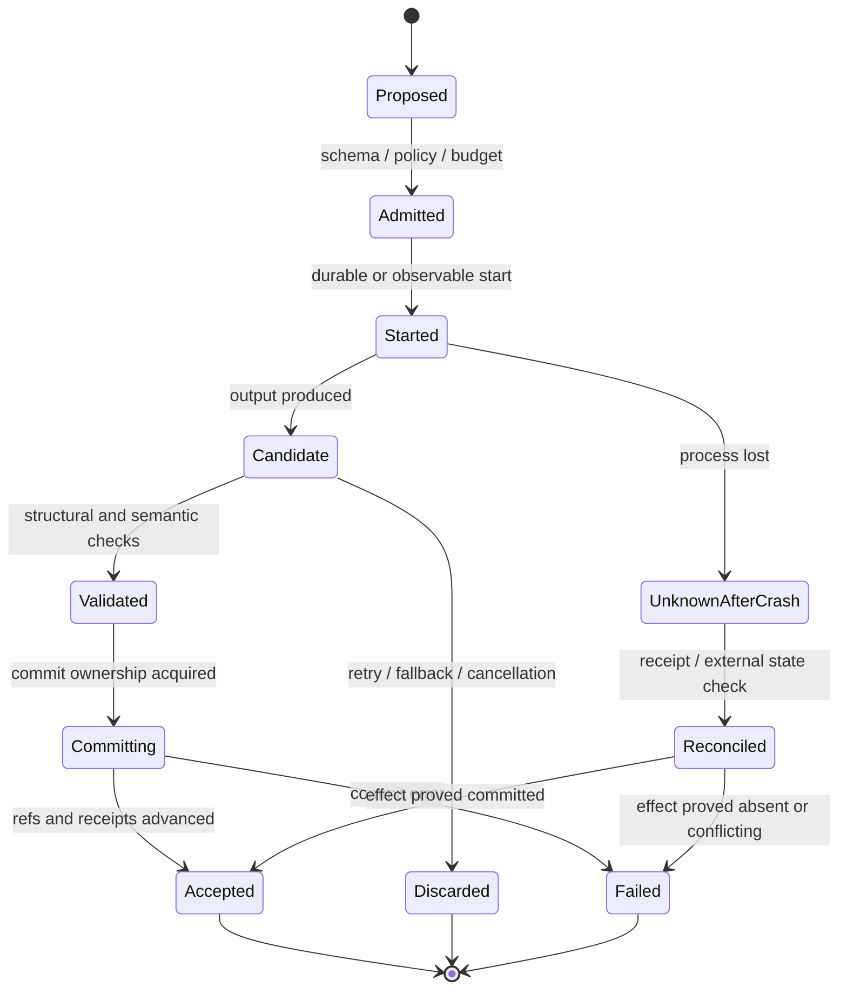

# 五个 Agent 仓库运行时深挖：调用链、不变量与测试证明链

> 日期：2026-08-10
>
> 定位：`reference_agent_framework_code_research_2026-08-10.md` 的第二轮代码证据卷
>
> 方法：固定版本、本地源码与测试代码的只读静态研究；未执行外部仓库测试、模型调用或 API
>
> 边界：本文是外部实现参考，不是 Code2Paper 规范、进度账本或验收结论

## 1. 为什么需要第二轮深挖

第一轮报告回答了“哪些机制值得借鉴”，但不足以支持实现评审，因为它没有始终回答四个问题：

1. 机制在真实调用链中何时进入、何时提交、何时回滚；
2. 状态机依赖哪些前置条件，失败后保留哪些事实；
3. 结论是只有源码实现，还是还有测试代码证明边界；
4. 迁移到 Code2Paper 时，哪些语义可以保留，哪些语义必须收紧。

本文使用下列证据标签：

| 标签 | 含义 | 可支持的结论 |
|---|---|---|
| `[S]` | 固定提交中的源码实现 | “该版本代码这样实现” |
| `[T]` | 固定提交中的测试用例 | “维护者把该边界作为可回归行为” |
| `[I]` | 从多处源码/测试联合推出的架构解释 | 需要与事实描述分开 |
| `[A]` | 面向 Code2Paper 的采用建议 | 不代表参考仓库原本意图 |

`[T]` 只表示阅读到测试代码，不表示本次研究运行并通过了测试。Hermes 和 PydanticAI 的本地
sparse checkout 没有物化相应测试集，因此这两部分的置信度主要是 `[S]`；OpenClaw、
OpenHands SDK 和 PydanticAI Harness 同时有 `[S]+[T]` 证据。

## 2. 固定版本与本地覆盖

| 仓库 | 固定提交 | 本轮深入范围 | 测试证据覆盖 |
|---|---|---|---|
| Hermes Agent | `326bdfb7a27e292a25aa1a8a073e6fac43460a98` | conversation、compression、tool executor、verification | 本地未物化通用测试集，源码级 |
| OpenClaw | `8fdf7570a17ffbbafe825bd379bab858f263b8ca` | embedded runner、attempt、delivery、retry budget | runner 目录本地有 221 个 `*.test.ts` |
| OpenHands SDK | `be6cd3b80b706bb14c91e604581a8de75cad61cc` | EventLog、View properties、condenser | 相关 event/view/condenser 测试已物化 |
| PydanticAI | `fc6a3ac506513150e2016ee5ba9785d792795150` | agent graph、capabilities、deferred、usage、graph builder | 本地 source/docs sparse，源码级 |
| PydanticAI Harness | `5e180850511dec469cc50aa9853675a8031d1f19` | step persistence、memory CAS、planning、workflow、output limits | 相关完整测试已物化 |

这里的“覆盖”不是对整个仓库完整性的声明。尤其 OpenClaw 和 PydanticAI 使用 sparse checkout；
本文只对本地已物化路径负责。

## 3. 五个仓库共同揭示的运行时窄腰

五套实现虽然目标不同，但都可以投影到同一个运行时状态机：



差异在于它们保护的对象不同：

- Hermes 保护一次压缩候选不与取消并发提交；
- OpenClaw 保护 provider fallback 中只有被接受的尝试推进 turn，并处理已经送达的不可逆副作用；
- OpenHands 保护事件历史与模型可见视图之间的结构不变量；
- PydanticAI 保护模型消息、工具调用、deferred work 和 hook 的类型边界；
- Harness 进一步把 step、tool effect 和存储 mutation 做成耐久状态。

`[I]` 对 Code2Paper 最关键的不是复制某个类，而是建立同样清楚的“candidate/accepted”、
“authority/projection”和“started/completed/unknown”三组分界。

## 4. Hermes Agent：压缩事务和请求投影

### 4.1 请求上下文选择的完整调用链

核心路径：

1. `[S]` `agent/conversation_loop.py:2029-2077` 构造本轮 API messages；
2. `[S]` `agent/conversation_loop.py:1286-1368` 的
   `_apply_context_engine_selection()` 深复制 conversation 与 incoming messages；
3. `[S]` 调用 context engine 的 `select_context()`，只允许改变本次请求视图；
4. `[S]` 只有“非空、元素均为 dict 的 list”可成为选择结果；异常或非法结果回退原请求；
5. `[S]` 选择完成后才进行 orphan tool call/result sanitation、thinking-only 清理、相邻 user
   消息合并和 provider canonicalization。

前置条件与后置条件：

| 项 | 契约 |
|---|---|
| 输入 | 持久 transcript 与 incoming message 的结构化副本 |
| 可变范围 | 仅当前 API request 的 message list |
| 成功后 | 仍需经过 provider-valid sanitation |
| 插件异常 | 返回原始请求副本，不破坏持久 transcript |
| 禁止事项 | selection 结果不得覆盖或缩短持久历史 |

深复制不是普通防御性编程。源码注释明确指出浅复制仍会别名共享嵌套容器，因此插件若原地修改
tool result 或 content part，可能污染权威 transcript。`[A]` Code2Paper 的 Writer brief、
projection 和压缩视图应采用同样的 copy-on-project，但 authority projection 的 schema/ID
闭包失败必须阻断，不能照搬 Hermes 的 fail-open 插件语义。

### 4.2 `CompressionCommitFence` 的并发语义

`[S]` `agent/conversation_compression.py:445-620` 将一次压缩提交拆成 admission、cancel、
begin commit、finish commit 四类动作。关键不是互斥锁本身，而是锁的持有区间：

```text
admit attempt
  -> produce candidate transcript
  -> begin_commit() 持锁判定取消是否已经获胜
  -> mutation / rotation / telemetry commit
  -> finish_commit() 由当前 holder 释放
```

不变量：

- `[S]` cancel 在 commit 前发生时，`begin_commit()` 必须拒绝；
- `[S]` commit 已开始时，cancel 只能等待，不能与共享状态修改并发；
- `[S]` `commit_in_flight` 用 Event 暴露，不需要无保护读取内部 holder；
- `[S]` admission 可在失败 unwind 时撤销；
- `[S]` release 绑定 holder，旧 attempt 不能释放后来者的锁，避免 ABA 类错误。

`[S]` `agent/conversation_compression.py:2160-2285,2996-3070` 把 fence 接到真实提交路径：

1. 入口先 snapshot compressor attempt state；
2. 为本次 attempt 建立 ID 并重置信号；
3. 候选返回后比较语义状态，而不是 Python 对象身份；
4. 无进展、空 transcript 或输入被意外原地修改时恢复 snapshot；
5. `begin_commit()` 失败时，在任何 session rotation 前恢复 messages 与 compressor；
6. 只有取得提交权后才旋转/写入，并记录 committed telemetry。

这个实现提供了强进程内事务，但没有提供跨进程 durable commit receipt。进程在共享状态已修改、
`finish_commit()` 前崩溃时，恢复者仍需从外部存储判断实际结果。`[A]` Code2Paper 应保留其
candidate fence 语义，但 accepted artifact 的切换应通过内容摘要清单或 CAS 完成。

### 4.3 工具 dispatch 与验证陈旧化

`[S]` `agent/tool_executor.py:141-157` 先拒绝非 object 参数；`178-206` 在展示工具进度前
flush session；`391-467` 建立并发授权 gate；`482-664` 把授权后的 dispatch 放在 middleware
保护路径，避免同一批准被重复执行。

`[S]` `agent/verification_evidence.py:36-48,414-458,528-626` 记录 command、kind、scope、
status、exit code、cwd/session 与输出摘要，并在工作区编辑后将旧验证标记 stale。

两者合在一起形成一条实用原则：执行“发生过”与验证“仍然新鲜”是两类状态。Code2Paper
不能只保留最后一个成功结果；验证后任何 source、artifact 或协议 identity 变化都应使证据失效。

### 4.4 Hermes 失败矩阵

| 故障 | Hermes 行为 | Code2Paper 采用判断 |
|---|---|---|
| selection 插件异常 | 回退原请求 | 仅展示优化可回退；权威投影应阻断 |
| candidate 无压缩进展 | 恢复 attempt snapshot | 采用，进展应定义为 obligation/issue/anchor 的确定变化 |
| cancel 先于 commit | 拒绝提交 | 采用 |
| cancel 晚于 commit | 等待提交结束 | 采用并增加 durable receipt |
| commit 进程崩溃 | 源码未形成跨进程裁决 | 不能直接采用，需 reconciliation |
| 工作区修改 | 旧 verification stale | 采用并扩展到 artifact/protocol/model identity |

### 4.5 证据强度

本地 Hermes checkout 没有通用测试目录。本节结论是 `[S]` 源码观察，不能表述为“测试已证明”。
深化后的采用建议应先在 Code2Paper 自身建立 fault-injection tests，再进入实现。

## 5. OpenClaw：accepted attempt 与不可逆 delivery

### 5.1 fallback attempt 的真实终态协议

`[S]` `src/agents/embedded-agent-runner/run-entry.ts:33-124` 定义 candidate 与 terminal result；
`152-187` 把 timeout、abort、yield、error 和 completed 收束为终态事实；`420-508` 执行候选
接收和清理。

调用链可还原为：

```text
acquire candidate intent / lease
  -> run provider candidate
  -> classify terminal status and delivery evidence
  -> if accepted: release attempt ownership, finalize context-engine turn
  -> else: discard candidate intent
  -> finally: clean unsettled intent and release lease
```

这里有一个容易遗漏的时序：测试名明确要求“accepted fallback candidate 在 attempt 释放 ownership
之后才 finalize”。这意味着 finalize 不是普通 `finally` 清理，而是 accepted lineage 的推进。

### 5.2 测试证明的候选边界

`[T]` `run-entry.test.ts` 给出了比实现注释更精确的行为表：

| 测试位置 | 固定行为 |
|---|---|
| `413-446` | 只有最终接受的 fallback candidate 被 finalize，且发生在 ownership release 后 |
| `448-486` | 文本结果为空，但已提交副作用时仍接受且只 finalize 一次 |
| `488-519` | fallback 全部耗尽时不 finalize 任一 candidate |
| `521-565` | yielded、aborted、timed-out、errored candidate 即使有标志也不推进普通 turn |
| `567-606` | classification 自身抛错时 candidate 被 discard |
| `608-652` | channel delivery 抛错但 reply 已送达时，不允许 fallback 重放 |
| `654-717` | delivery 抛错且没有送达任何内容时，仍允许 fallback |

最重要的反直觉点是“空结果 + committed side effect”可以成为 accepted terminal。对聊天系统，
送达事实高于返回文本；对 Code2Paper 则不能直接类比为“写过文件就接受内容”。`[A]` 这里应拆成：

- `effect_committed=true`：禁止盲目重放相同写操作；
- `candidate_accepted=true`：只有内容、证据、作者与完整性 gate 全部通过才推进 accepted lineage。

两者可能一个真、一个假。

### 5.3 delivery evidence 的匹配算法

`[S]` `delivery-evidence.ts:16-99,385-543` 不只记录布尔 `sent`，而是收集 payload/target
级记录并归一成 canonical partial outcome。`[T]` `delivery-evidence.test.ts` 证明：

- `85-129` aggregate evidence 必须由 target records 完整代表；重复 payload 按 multiplicity 计数；
- `176-212` partial media retry 需要每个 payload 的精确证据，截断后的 payload 不能算匹配；
- `214-245` hidden media 不可自动记为 delivered，但被有意 suppress 的可交付 media 可记为 durable；
- `247-294` 所有 partial outcome 进入一个规范状态机；单 payload 的 ambiguous 只能在显式策略下记账。

`[I]` 这相当于“副作用闭包匹配”，而不是“某个布尔值成功”。映射到产物写入，receipt 至少要绑定
目标 artifact、期望 digest、实际 digest、operation ID 和 multiplicity；否则多个相同文件或多分区
回调会被粗粒度成功标志掩盖。

### 5.4 retry budget 的双计数

`[S]` `run/retry-budget.ts:1-39` 同时维护 dispatched attempts 与 counted retries。begin 会增加
两者；若 continuation 被判定有进展，可撤销本次 counted retry，但不会抹掉历史重试。

`[T]` `run/retry-budget.test.ts:11-58` 固定了三条边界：

- 有进展的 continuation 可以超过 32 次；
- 32 次无进展会停止；
- 一次有进展 continuation 不会清零更早消耗的 retry。

`[A]` Code2Paper 可采用“双计数”，但不应照搬“出现非错误工具元数据即有进展”。可退款进展应是
确定性的状态变化，例如新增经验证 span/relation、关闭一个 issue、减少未满足 move，且仍保留总调用硬上限。

### 5.5 OpenClaw 失败矩阵

| 终态事实 | 是否推进 candidate | 是否允许重放 | Code2Paper 对应 |
|---|---:|---:|---|
| completed + accepted + 无副作用歧义 | 是 | 否 | 正常 accepted attempt |
| candidate error + 未送达 | 否 | 是 | 可进入有界 owner retry |
| candidate error + 已送达 | 普通 turn 不推进 | 否 | 先 reconcile effect，禁止盲重放 |
| empty result + committed side effect | 是 | 否 | 仅 effect receipt 可成立，内容接受仍需 gate |
| classification error | 否 | 视 delivery evidence | validator 自身错误不得授权内容 |
| fallback exhausted | 否 | 否/blocked | 保留 incumbent，输出 terminal failure |

### 5.6 证据强度

OpenClaw 本节是 `[S]+[T]`。本次没有执行测试，但核心候选与 delivery 边界有直接测试用例，
因此可作为 attempt/effect 设计的最强参考之一。

## 6. OpenHands SDK：权威事件、可变 View 与不变量交集

### 6.1 `EventLog` 的追加与树语义

`[S]` `openhands-sdk/openhands/sdk/conversation/event_store.py:91-126,184-228` 的追加路径：

1. 在锁内刷新/读取当前索引；
2. 拒绝 duplicate event ID；
3. 验证显式 parent 存在；
4. 追加 event 文件并同步持久化；
5. 更新 index/cache。

树遍历对历史格式提供 effective parent fallback，但检测 cycle、self-parent 和 missing parent。

`[T]`：

- `tests/sdk/conversation/test_event_store.py:362-417` 覆盖线程并发 append 与两个实例串行写；
- `tests/sdk/conversation/test_event_tree.py:67-80` 覆盖 cycle/missing/self parent 失败；
- `94-113` 固定 legacy parent 的线性兼容行为。

这个 EventLog 的强项是追加和拓扑；它不是内容寻址 artifact store。`[A]` Code2Paper 不应为了
“像 OpenHands”重写现有不可变 artifact 机制，而应把事件用作控制平面，并继续让 artifact digest
承担内容权威。

### 6.2 `View.manipulation_indices()` 为什么是交集

`[S]` `context/view/view.py:22-160` 对每个 property 计算合法 manipulation indices，然后取所有
property 集合的交集。任一 property 认为切点不安全，该切点就不可用。

`enforce_properties()` 不是单遍过滤：某个 property 删除事件后，从第一个 property 重新检查，直到
固定点。这避免修复 A 后破坏早先已经检查过的 B。

现有属性提供四类约束：

- `ToolCallMatchingProperty`：一个 action 精确匹配一个 result；
- `BatchAtomicityProperty`：同一 `llm_response_id` 的 action batch 不可部分保留；
- `ToolLoopAtomicityProperty`：工具循环边界不可从中间切开；
- `ObservationUniquenessProperty`：重复 observation 不可进入视图。

`[S]` `tool_call_matching.py:15-100` 特别使用 `remove` 而不是 `discard` 关闭 pending call；若同一
result 被重复消费，会显式暴露违反条件，而不是静默容忍。

`[S]` `batch_atomicity.py:10-88` 在 batch 只剩部分可见时移除整个 batch，并拒绝在连续 actions
中间切分。

### 6.3 测试证明的安全切分点

`[T]` `tests/sdk/context/view/test_view_manipulation_indices.py`：

| 位置 | 预期安全边界 |
|---|---|
| `244-260` | 两个 actions + 两个 observations 只能在 `{0,4}` 切分 |
| `263-281` | 多批次被消息隔开时，只允许完整原子单元之间的边界 |
| `284-298` | 三 action batch 的安全边界是 `{0,6}` |
| `301-321` | action/result pair 作为一个整体夹在普通消息之间 |
| `324+` | forgetting range 只能从交集中的合法起止位置选择 |

`[A]` Code2Paper 的 manipulation property 不应以“消息”为原子，而应至少覆盖：

- evidence packet、fact、claim、coverage binding；
- callback request、validated artifact、resume marker；
- Writer/Editor/Rewrite span 与 authorship ledger；
- candidate artifact closure 与 acceptance report。

只有所有 property 同意的边界才能用于压缩、局部恢复或丢弃候选。

### 6.4 condensation 的 hard/soft 行为

`[S]` Condensation 修改 `View`，不修改 `EventLog`。`[T]`
`test_llm_summarizing_condenser.py` 固定了失败语义：

- `578-594` 零 events 不调用模型并报错；
- `625-662` event pressure 是 soft，token pressure 是 hard；
- `674-718` request pressure 为 hard；无安全 condensation range 且不能 hard reset 时抛错；
- `721+` soft pressure 无安全 range 时返回原 view。

这里的精髓是 hard pressure 不能伪装成成功。对 Code2Paper，如果 Writer 输入超过上下文且不存在
不破坏权威原子组的压缩方案，应阻断/拆分，而不是把缺失的 evidence 视为“模型应该能猜到”。

### 6.5 不应直接复制的 fixed-point 删除

OpenHands 的 View 可以通过删除不一致事件得到 provider-valid 视图，因为权威 EventLog 仍保留原文。
Code2Paper 的 authority ledger 不可采用“发现不匹配就删除 claim/result 继续”的语义。`[A]`：

- 对非权威 Writer view，可删除或压缩，但必须生成 projection receipt；
- 对 packet/fact/claim 或 callback 权威闭包，任何不匹配应标记 projection invalid 并 fail closed；
- 不得通过过滤失败 claim 让最终 gate 通过。

### 6.6 证据强度

OpenHands 本节是 `[S]+[T]`，且测试直接覆盖结构边界、并发 append 和 hard condensation failure，
适合支撑 Code2Paper 的 projection invariant 设计。

## 7. PydanticAI：类型窄腰、恢复能力与权限边界

### 7.1 run/conversation identity

`[S]` `pydantic_ai_slim/pydantic_ai/_agent_graph.py:231-289`：conversation ID 可以继承或 fork，
但 run ID 不继承，也不能在传入 message history 中复用。这让“对话连续”与“执行尝试唯一”分离。

`[S]` `GraphAgentState`（约 `293-373`）同时保存 messages、usage、retries、run identity、pending
messages、event buffer 和 cache。消息历史不是唯一状态源，usage/retry/run 都有独立字段。

`[A]` Code2Paper 应维持相同区分：project/run/conversation 可以组织多轮协作，但每次 Research、
Writer 或 Repair attempt 必须有独立 attempt ID，不能用同一 thread ID 代替执行身份。

### 7.2 streaming 异常仍保存部分事实，但不掩盖原异常

`[S]` `_agent_graph.py:1086-1325` 的 stream lifecycle 使用单消费协作。消费者异常时取消包装任务，
但会捕获部分 response，绑定 run/conversation identity，并累计已发生 usage。尤其 `1292-1309`
避免 usage limit 异常覆盖原始 consumer exception。

这给出两个可迁移规则：

1. 失败 attempt 仍应记录已发生的调用和部分产物事实；
2. 衍生的计费/清理错误不得覆盖根因，但可以作为 secondary failure 附加。

### 7.3 dangling tool-call recovery 的精确边界

`[S]` `_agent_graph.py:2599-2765` 对 message history 进行有序扫描：

- out-of-place 或 duplicate tool result 不会关闭另一个 pending call；
- orphan result 被丢弃，而不是跨消息边界重排；
- synthesized tool return 确定且幂等；
- 默认不修复最后一个仍然 live 的 frontier。

这是“representation-only repair”的好例子：它修复 provider transcript 结构，而不声称工具内容真实。
`[A]` Code2Paper 只能把这类修复用于 JSON envelope、缺失 wrapper 或已知 result 的重新绑定，绝不能
合成 span、fact、claim、验证 verdict 或 callback artifact。

### 7.4 capability 的顺序与恢复权限

`[S]` capability 体系提供显式顺序：

- `abstract.py:277-316` 定义 per-agent/per-run binding 及 ordering constraints；
- `660-719` 的 after-model hook 可以触发 retry，error hook 甚至可以返回成功 response；
- `723-816` 中 tool args 先验证再允许 defer；error hook 可返回已验证 args；
- `820-877` 允许执行后 defer，但源码明确提示此时副作用可能已经发生；
- combined capability 先拓扑排序，再按 before-forward、after/error-reverse 的顺序组合。

这套机制很灵活，也正因如此不能承载 Code2Paper 最终 authority gate。普通 hook 能 suppress/recover
错误；证据、作者、数字、公式、qualifier 和 final-integrity gate 必须位于不可被 capability error hook
改写为成功的核心节点。

### 7.5 deferred work 的精确 ID

`[S]` `_deferred.py:26-196` 用 tool call IDs 对 deferred request/result 做精确匹配，拒绝额外 result ID，
并保留 remaining unresolved calls。它很适合解释 Writer callback 的“一个请求只由绑定结果满足”。

边界是普通 call result 可包装任意值。`[A]` Code2Paper 不能只要求 ID 匹配，还要要求结果是带 authority
lane、artifact ref/digest、validator identity 和 affected section/unit 的类型化 artifact。

### 7.6 usage 与 graph validation

`[S]` `usage.py:418-572` 在请求前计 request count，在响应后计 token/cost；可选 pre-count token，
所以一次请求可能在发现 token 超限前已经产生费用。并发时单纯“检查剩余后执行”仍可能超卖。

`[S]` graph builder 的 `_validate_graph_structure`（约 `1752-1859`）检查 start/end、dead end 和 reachability，
但调用者可以通过 `validate_graph_structure=False` 关闭。`[A]` Code2Paper 的 plan gate 不应暴露同类 bypass。

### 7.7 证据强度

本地 PydanticAI 没有物化相应测试集，因此本节为 `[S]`。尤其 capability error recovery 的采用必须
以 Code2Paper 自己的“hard gate 不可恢复”回归测试为准。

## 8. PydanticAI Harness：耐久 step、effect receipt 与 CAS

### 8.1 step 与 tool effect 的状态词汇

`[S]` `pydantic_ai_harness/step_persistence/_types.py:11-143` 将运行记录拆成：

- append-only lifecycle events；
- tool effect 的 `started | completed | failed`；
- snapshot 的 `complete | interrupted`；
- conversation/run/parent identities；
- `started` 在恢复时承担 unknown-after-crash 语义。

这里没有把“进程退出”自动解释成“工具没执行”。这正是耐久副作用处理与普通异常重试的分界。

### 8.2 capability 的保存时点

`[S]` `step_persistence/_capability.py:411-555`：

1. before tool：先写 started effect 与事件；
2. after tool：保留 started_at、idempotency key、effect summary，标 completed；
3. tool error：标 failed，保留 idempotency key，然后重新抛出；
4. after `CallToolsNode`：暂存 live history，只在 provider-valid settled boundary 保存 complete snapshot；
5. 若崩溃留下 dangling tool call，只能保存 interrupted snapshot。

`[T]` `tests/step_persistence/test_step_persistence.py`：

| 位置 | 被固定的行为 |
|---|---|
| `1181-1207` | dangling tool crash 只保存 interrupted；默认 latest 不返回它 |
| `1208-1254` | 后续 provider failure 恢复最新完整 tool cycle，而不是更老文本状态 |
| `1256+` | 更新的 text history 可优先于更早 boundary |
| `1487-1532` | completed/failed 都保留 idempotency/effect metadata |
| `1836+` | tool cycle 中崩溃时，已完成 cycles 仍能作为 interrupted rescue 内容 |

这比“每个 node 后保存 messages”更精确：可恢复快照与诊断快照不同。`[A]` Code2Paper 同样应区分
可继续的 accepted checkpoint 和只供诊断的 interrupted attempt snapshot。

### 8.3 retention 不牺牲最后一个可恢复状态

`[T]` `test_snapshot_retention.py:97-149` 证明 bounded window 之外仍保留最新 complete snapshot：

- 尾部全是 interrupted 时，保留窗口下方最近的 complete；
- `keep=1` 且最新是 interrupted 时可能保留两个文件；
- 如果全是 interrupted，则不会虚构一个 complete。

因此 retention 上限不是简单 `tail -N`。对 Code2Paper，清理 candidate artifacts 时也必须先保留最近
accepted closure；空间策略不能删除唯一可恢复的权威状态。

### 8.4 memory store 的 CAS 与 operation receipt

`[S]` `memory/_store.py:29-115` 定义 version、operation ID/fingerprint 和冲突；file store 的
prepare/write 路径约 `631-685`：先恢复未决 prepared operation，再检查 operation replay 与
expected version，持久化 prepared record，最后应用并完成 receipt。

`[T]`：

- `tests/memory/test_memory.py:442-466`：并发实例不会丢 append；相同 operation 可 replay；同 ID
  不同 fingerprint 冲突；
- `tests/memory/test_stores.py:114-135`：多种 local store 都满足 operation receipt；
- `331-375`：跨实例 CAS 串行化和 prepared write recovery；
- `391-445`：完成后的 recovery payload 被 scrub，读取 receipt 仍可触发 prepared recovery；
- `447-526`：已经应用、外部写入冲突和 delete recovery 各有明确分支。

`[A]` 这是 Code2Paper artifact mutation 最可直接采用的参考：

```text
operation_id + input_fingerprint + expected_version
  -> prepared
  -> write/replace
  -> committed(actual_digest)
```

但当前 Code2Paper 多数产物是内容寻址 append-only；CAS 应优先用于“accepted manifest 指针”、
callback sidecar 或可变索引，不要给每个 immutable artifact 增加无意义的全局锁。

### 8.5 planning、dynamic workflow 与 tool output

`[S]+[T]` Harness planning 对 cycle、missing dependency、批次状态更新、handoff/reblocking 做整体
验证。可借鉴之处是“整批先验证、再原子应用”，而不是依次应用到一半才发现非法状态。

`[T]` `dynamic_workflow/test_dynamic_workflow.py:561-634` 覆盖精确总调用上限和并发 fan-out；
`723` 固定类型错误发生在预算消费前；`829-870` 固定共享 usage counter。`[A]` 如果 Code2Paper
未来并行化 Research children，需要 reservation；当前串行路径先修复预算增量实际落账更重要。

`[S]+[T]` tool output limits 支持 spill + handle + bounded read，但
`test_tool_output_limits.py:430` 明确允许 spill failure 回退 truncate。这个 fallback 对普通 UX 合理，
对权威 evidence 不可接受：无法 lossless spill 时必须失败，截断只能作为 preview，不能成为事实源。

### 8.6 Harness 失败矩阵

| 故障 | 持久状态 | 默认 resume | Code2Paper 采用判断 |
|---|---|---|---|
| tool success | completed effect + complete boundary | 可恢复 | 采用并绑定 artifact closure |
| tool throws | failed effect | 可按 owner policy retry | 保留 idempotency 与实际副作用信息 |
| crash after started | started/unknown | 不盲重放 | 强烈采用 |
| dangling tool history | interrupted snapshot | 默认跳过 | 采用 |
| prepared write 重放 | fingerprint 相同则 reconcile | 幂等完成 | 采用于可变 manifest |
| operation ID 相同但输入不同 | conflict | 阻断 | 强烈采用 |
| spill 失败 | 可退 truncate | 继续 | 仅非权威输出可采用 |

### 8.7 证据强度

Harness 本节是 `[S]+[T]`，并且测试覆盖崩溃、跨实例、prepared recovery、fingerprint conflict、
retention 和并发预算，是 durable effect/manifest 设计最强参考。

## 9. 跨仓库不变量归并

### 9.1 需要成为 Code2Paper 硬契约的六条不变量

1. **权威与视图分离**：任何 projection/condensation 只改变 request view，不改变权威 artifact。
2. **候选不污染 incumbent**：validation 完成前，candidate 只能写入 attempt namespace。
3. **内容接受与副作用发生分离**：effect committed 不等于 content accepted；但 committed effect
   会限制重放策略。
4. **原子组切分取交集**：packet/fact/claim、request/artifact/resume、span/ledger 等所有 property
   同意后才允许压缩或局部恢复。
5. **unknown-after-crash 是一等终态**：started 不能被恢复器解释成未执行。
6. **验证新鲜度属于 identity**：源码、输入、协议、模型、artifact closure 任一变化都会使旧验证失效。

### 9.2 机制不是同一层，不能互相替代

| 层 | 参考机制 | 不能替代什么 |
|---|---|---|
| 请求视图 | Hermes selection、OpenHands View | 不能成为证据账本 |
| attempt 控制 | Hermes fence、OpenClaw candidate | 不能证明 artifact 内容正确 |
| 内容门禁 | Pydantic typed validation | 不能证明副作用未重复 |
| 副作用耐久性 | OpenClaw delivery、Harness effect/CAS | 不能授权论文事实 |
| 恢复 | Harness complete/interrupted snapshot | 不能自动恢复同一模型/协议身份 |
| 预算 | OpenClaw/Harness counters | 不能代替 no-progress 与 owner routing |

### 9.3 明确拒绝的迁移方式

- 不把 Hermes fail-open selection 用于 authority validation；
- 不把 OpenClaw “已送达”直接等同于 Code2Paper “已接受内容”；
- 不把 OpenHands 删除不一致事件的 fixed-point repair 用于权威 evidence ledger；
- 不把 PydanticAI 可恢复 error hook 放在不可放松的最终 gate 外层；
- 不把 Harness spill failure 的 truncate fallback 用于权威源码或证据；
- 不因为参考框架支持并发，就在当前串行 research loop 尚未正确落账前引入并发 reservation 复杂度。

## 10. 供架构评审使用的判定清单

对任何拟引入机制，评审应逐项回答：

1. authority source 是哪个不可变 artifact，view 是否可独立重建；
2. attempt ID、run ID、snapshot/tree、协议和模型身份如何绑定；
3. started、candidate、validated、accepted、discarded、failed、unknown 分别落在哪里；
4. 取得 commit ownership 前是否可能修改 incumbent；
5. crash 后如何判断副作用已发生、未发生或冲突；
6. operation replay 是否同时校验 ID 和 input fingerprint；
7. 局部恢复的安全切分点是否由所有不变量交集决定；
8. retry budget 在何时预留、何时消费、何时允许退款；
9. validator/hook 能否把 hard failure 转换为成功；
10. 测试是否覆盖取消竞态、进程崩溃、重复 result、partial effect、跨实例和 stale identity。

如果其中任何一项只能回答“依赖约定”或“由模型判断”，该机制还不足以进入 Code2Paper 的信任链。
